# Grovekeeper — Architecture

## Vision

Desktop agent orchestration GUI replacing multi-app workflow chaos. Unifies task state, editor, terminal, browser, and agent session into a single per-task view with reliable notifications.

## Tech Stack

- **Desktop framework:** Tauri v2 (Rust backend)
- **Frontend:** SvelteKit 2 + Svelte 5 (runes, SPA mode, static adapter)
- **Styling:** Tailwind CSS 4
- **Database:** SQLite via rusqlite (bundled), r2d2 connection pool
- **Type generation:** ts-rs (Rust → TypeScript, single source of truth)
- **Git:** `git` CLI primary, `git2` crate for performance-critical reads
- **GitHub:** `gh` CLI primary, `gh api graphql` for bulk sync
- **Auth:** `gh auth` (no PAT management in app)
- **Testing:** Vitest (unit), Playwright (E2E), Storybook (components)

## Core Vocabulary

See `.mpx/VOCABULARY.md` for canonical terms.

## Architecture Diagram

```mermaid
graph TB
    subgraph UI ["UI Layer — Thin Orchestrators"]
        IP["issues/+page.svelte"]
        SP["sessions/+page.svelte"]
        SET["settings/+page.svelte"]
        LAY["+layout.svelte<br/>Context provider"]
    end

    subgraph MODULES ["Deep Domain Modules (src/lib/modules/)"]
        direction TB
        subgraph IM ["issues/"]
            IMI["useIssues()<br/>CRUD, labels, worktrees, sorting"]
        end
        subgraph SM ["sessions/"]
            SMI["useSessions()<br/>spawn, terminate, state, events"]
        end
        subgraph VCM ["version-control/"]
            VCMI["useVersionControl()<br/>git status, GitHub sync, PR state"]
        end
        subgraph BM ["board/"]
            BMI["useBoard()<br/>dashboards, palettes, theme, view"]
        end
        subgraph NM ["notifications/"]
            NMI["useNotifications()<br/>pending alerts, config, sounds"]
        end
        subgraph AM ["actions/"]
            AMI["useActions()<br/>action templates, execution"]
        end
        subgraph VM ["visualization/"]
            VMI["computeVisualization()<br/>computeForestLayout()<br/>Pure functions, no reactivity"]
        end
    end

    subgraph SHARED ["Shared Infrastructure"]
        TYPES["types/generated/<br/>ts-rs output (27 types)"]
        REACT["reactivity/<br/>StateRaw, Persisted"]
    end

    subgraph RUST ["Rust Backend (Tauri v2)"]
        subgraph RCMD ["Tauri Commands<br/>(IPC layer)"]
            RC1["issue_commands"]
            RC2["session_commands"]
            RC3["github_commands"]
            RC4["git_status_commands"]
            RC5["dashboard_commands"]
            RC6["worktree_commands"]
            RC7["action_commands"]
            RC8["notification_commands"]
            RC9["color_palette_commands"]
            RC10["portfolio_commands"]
            RC11["label_shape_mapping_commands"]
        end

        subgraph RSESS ["Session Subsystem"]
            RA["session_actor<br/>tokio task per session"]
            RP["protocol_parser<br/>stream-JSON → SessionEvent"]
            RD["discovery + polling<br/>~/.claude/projects/ JSONL"]
            RPR["provider trait<br/>ClaudeCodeProvider (v1)"]
        end

        subgraph RNOTIF ["Notification Service"]
            RNS["notification/service<br/>toast, sound, window flash"]
        end

        subgraph RDB ["Database"]
            RPOOL["DatabaseState<br/>read_pool (r2d2, 4 readers)<br/>write_conn (Mutex, 1 writer)"]
            RSCH["schema.rs — 9 tables<br/>migrations.rs — v1→v9"]
        end
    end

    subgraph EXT ["External"]
        CC["Claude Code CLI<br/>stream-JSON protocol"]
        GH["gh CLI<br/>GitHub API"]
        GIT["git CLI + git2 crate"]
        ED["VS Code / Cursor"]
        MPX["mpx-claude-code scripts<br/>setup-worktree.sh"]
    end

    LAY --> BM & NM & SM & IM & VCM & AM
    IP --> IM & SM & VCM & BM & NM & AM & VM
    SP --> SM
    SET --> BM & NM

    MODULES -.->|"invoke()"| RCMD
    SM -.->|"listen()"| RA

    RCMD --> RPOOL
    RSESS --> RPOOL
    RA --> RPR --> CC
    RC3 --> GH
    RC4 --> GIT
    RC6 --> MPX

    style MODULES fill:#4ecdc4,color:#000
    style SHARED fill:#a8d8ea,color:#000
    style RPOOL fill:#f9e79f,color:#000
```



## Deep Module Architecture

The codebase follows John Ousterhout's "A Philosophy of Software Design" — deep modules with small interfaces hiding large implementations. Each module owns its types, IPC calls, state management, and event listeners behind a minimal public API.

### Module Structure

```
src/lib/
  modules/
    sessions/index.svelte.ts      — reactive, event listeners
    version-control/index.svelte.ts — reactive
    issues/index.svelte.ts         — reactive, worktree events
    board/index.svelte.ts          — reactive, localStorage
    notifications/index.svelte.ts  — reactive
    actions/index.svelte.ts        — reactive
    visualization/index.ts         — pure functions, no reactivity
  types/
    generated/                     — ts-rs output (DO NOT EDIT)
      index.ts                     — barrel re-export of all 27 types
  reactivity/                      — shared primitives (StateRaw, Persisted)
  components/                      — UI components import from modules
```

### Module Convention

Each reactive module follows this pattern:

```typescript
import { createContext } from 'svelte';

type ModuleContext = ReturnType<typeof createModuleContext>;
const [useModule, setModuleInternal] = createContext<ModuleContext>();
export { useModule };

export function setModuleContext(/* dependencies */) {
	const ctx = createModuleContext(/* ... */);
	setModuleInternal(ctx);
	return ctx;
}

function createModuleContext(/* dependencies */) {
	let items = $state<Item[]>([]);
	const derived = $derived(/* ... */);

	return {
		get items() {
			return items;
		},
		get derived() {
			return derived;
		},
		async loadItems(id: string) {
			/* invoke() */
		},
		// ...
	};
}
```

- **Entry point:** always `index.svelte.ts` (or `index.ts` for pure modules)
- **Context hooks:** `use<ModuleName>()` (consumer) + `set<ModuleName>Context()` (provider)
- **IPC:** `invoke()` calls are inlined inside the module — not a separate layer
- **Types:** import from `$lib/types/generated` for Rust-generated types; define module-internal types locally
- **Naming:** kebab-case folders (`version-control`), PascalCase types, snake_case variables

### Import Convention

```typescript
// Generated types (from Rust via ts-rs)
import type { Session, Dashboard } from '$lib/types/generated';

// Module APIs
import { useIssues, type Issue } from '$lib/modules/issues/index.svelte.js';
import { useSessions } from '$lib/modules/sessions/index.svelte.js';
import { useVersionControl } from '$lib/modules/version-control/index.svelte.js';
import { useBoard } from '$lib/modules/board/index.svelte.js';
import { useNotifications } from '$lib/modules/notifications/index.svelte.js';
import { useActions } from '$lib/modules/actions/index.svelte.js';

// Pure functions
import { computeVisualization, computeForestLayout } from '$lib/modules/visualization';

// Reactivity primitives (shared)
import { Persisted } from '$lib/reactivity/persisted.svelte';
```

## Architecture Decisions

| Decision             | Choice                                                                           | Rationale                                                                           |
| -------------------- | -------------------------------------------------------------------------------- | ----------------------------------------------------------------------------------- |
| Type generation      | ts-rs with `serde-compat`                                                        | Single source of truth in Rust; eliminates type drift between languages             |
| Database concurrency | r2d2 connection pool (4 readers + 1 writer)                                      | WAL mode supports concurrent reads; eliminates lock contention                      |
| State machine        | Rust-side resolved `SessionState` via `resolved_state` field                     | Eliminates duplicate state machine in TypeScript; `RUN_STATE_MAP` deleted           |
| Module location      | `src/lib/modules/<name>/`                                                        | Preserves `$lib` alias, co-locates with tests                                       |
| GitHub + Git Status  | Unified via `GitStatusCache` type in `version-control` module                    | Eliminates `pr_state` type mismatch (`string` vs `PullRequestState` enum)           |
| Module entry point   | `createContext()` from Svelte 5.40+                                              | Type-safe context without key strings; factory pattern enables dependency injection |
| Frontend migration   | Delete-and-replace                                                               | Few consumers; Svelte compiler catches all breaks at build time                     |
| Database migration   | Wrap-and-inline (commands acquire connection via `state.read()`/`state.write()`) | Many consumers; minimal diff per command file                                       |

## Rust Backend Modules

### Session Subsystem

- **Session actor:** One tokio task per spawned session. Reads stdout line-by-line, parses stream-JSON events, emits to frontend via Tauri events, updates SQLite.
- **Protocol parser:** Converts Claude Code's `stream_event` envelope into `SessionEvent` tagged union. Handles all tiers: lifecycle, text streaming, tool execution, permission prompts.
- **Discovery polling:** Scans `~/.claude/projects/` JSONL files for externally-launched sessions. ~2-3s detection latency.
- **Provider trait:** Abstraction for future providers (Codex, Copilot). V1 implements `ClaudeCodeProvider` only. `provider` field on every session.
- **Event payload:** `SessionEventPayload` includes `resolved_state: Option<SessionState>` — the Rust actor resolves raw protocol states to the app's state enum before emitting to the frontend.

### GitHub Service

- **Primary interface:** `gh` CLI for single-item queries and mutations.
- **Bulk sync:** `gh api graphql` for refreshing state across many issues.
- **PR state resolution:** Maps `gh` CLI output to `PullRequestState` enum (8 variants including `ReadyToMerge`).
- **Immediate fetch:** After Grovekeeper-initiated actions, immediately fetch related state.
- **Cache:** `git_status_cache` table with `fetched_at` timestamps.

### Git Service

- **`git` CLI** for: worktree operations, `merge-tree` (conflict detection), `rev-list` (behind-base count), fetch, merge, push.
- **`git2` crate** for: batch ref lookups, branch existence checks, status queries.
- **Worktree lifecycle:** Shell out to `mpx-claude-code/scripts/setup-worktree.sh` and `remove-worktree.sh`.
- **Fetch coordinator:** Deduplicate parallel `git fetch` calls per repo root.

### Notification Service

- **In-app:** Badge/dot indicators on issue cards and session tabs.
- **System toast:** Tauri notification plugin (cross-platform).
- **Sound:** Configurable per event type. Different sounds for needs-input (urgent) vs needs-review (gentle).
- **Window attention:** Tauri window attention request (needs-input only).

### Platform Abstraction

- **Terminal:** Spawn user's preferred terminal with working directory.
- **Editor:** Launch VS Code / Cursor via CLI. Peacock color sync.
- **Paths:** Cross-platform path handling.

## IPC Communication

Two patterns between frontend and Rust:

| Pattern                   | Direction                  | Use Case                                            |
| ------------------------- | -------------------------- | --------------------------------------------------- |
| **Commands** (`invoke()`) | Frontend → Rust → response | CRUD, spawn session, sync GitHub, config            |
| **Events** (`listen()`)   | Rust → Frontend (push)     | Session streaming, state changes, worktree progress |

Commands return `Result<T, String>`. Events are fire-and-forget with typed payloads.

### Tauri Event Channels

| Event                         | Payload                      | Source            |
| ----------------------------- | ---------------------------- | ----------------- |
| `session-event`               | `SessionEventPayload`        | Session actor     |
| `discovered-sessions-updated` | `DiscoveredSessionsPayload`  | Discovery polling |
| `worktree-progress`           | `WorktreeProgressPayload`    | Worktree commands |
| `worktree-state-change`       | `WorktreeStateChangePayload` | Worktree commands |

## Database

### Connection Architecture

```
DatabaseState
├─�� read_pool: r2d2::Pool (4 concurrent readers)
│   └── Each connection: WAL mode + foreign_keys=ON
├── write_conn: Mutex<Connection> (exclusive writer)
│   └── WAL mode + foreign_keys=ON
└── Actor connections: independent per session actor
    └── open_actor_connection() — WAL mode
```

Read commands use `state.read()`, write commands use `state.write()`. Mixed commands (read then write) release the read connection before acquiring the write lock.

### Schema (v9)

9 tables. Source of truth: `src-tauri/src/database/schema.rs`

| Table                          | Purpose                                                  |
| ------------------------------ | -------------------------------------------------------- |
| `color_palettes`               | Dashboard color palette definitions                      |
| `dashboards`                   | Dashboard configuration (repo or portfolio type)         |
| `issues`                       | Core issue records with worktree state, labels, metadata |
| `portfolio_dashboard_pointers` | Links between portfolio dashboards and repo dashboards   |
| `label_shape_mappings`         | GitHub label → tree shape mapping per dashboard          |
| `sessions`                     | Agent session records with state, cost, tokens           |
| `actions`                      | Configurable action button templates                     |
| `notification_config`          | Per-event notification preferences                       |
| `git_status_cache`             | Cached git + GitHub state per issue                      |

### Type Generation (ts-rs)

27 Rust structs/enums are annotated with `#[derive(TS)]` + `#[ts(export)]`. Running `cargo test` generates TypeScript type files into `src/lib/types/generated/`.

Configuration: `src-tauri/.cargo/config.toml` sets `TS_RS_EXPORT_DIR`.

Special handling:

- `#[ts(type = "number")]` on `i64`/`u64` fields (JavaScript has no 64-bit integers)
- `serde-compat` feature respects `#[serde(rename_all = ...)]`, `#[serde(tag = ...)]` for tagged unions
- `SessionEvent` generates as a TypeScript discriminated union via `#[serde(tag = "type", rename_all = "snake_case")]`

## Planned Architecture Changes

### Upcoming Improvements

- **`DatabaseState::read()`/`write()` → `Result` return:** Current `.expect()` calls should return `Result` to propagate pool exhaustion / mutex poisoning errors gracefully instead of panicking.
- **Batch refresh command:** `refreshAllForDashboard` currently makes N+1 IPC calls. A single batch Tauri command would reduce overhead.
- **Pre-computed `childrenByParentId` map:** Replace per-parent linear scan with a `$derived` `SvelteMap` for O(1) lookups.
- **`computeVisualization` context parameter:** The pipeline entry point currently omits tree context (session count, completed sessions, commits). Adding a `TreeComputeContext` parameter completes the pipeline.

### Phase 2 Preparation (Evaluation Dashboard)

The session module interface will extend with:

- `getSessionMetrics(sessionId)` — per-turn cost, token, and tool data
- `getSessionEvents(sessionId)` — full transcript for rich chat rendering (Phase 3)

These additions do not change the module structure — they add methods behind the existing `useSessions()` interface.

### Phase 4 Preparation (Multi-Provider)

The `SessionProvider` trait in Rust is already abstracted. Adding new providers (Codex, Copilot) means:

1. Implement the trait (5 methods: `spawn`, `send_message`, `interrupt`, `terminate`, `parse_event`)
2. Register the provider in the session manager
3. Frontend session module is unchanged — it works with `SessionEvent`, never raw provider formats

## Reference Repositories

See `REFERENCES.md` for the full list with descriptions. Key references per feature area:

- **Session monitoring:** c9watch, OpenCovibe
- **Multi-provider:** cline
- **Task board + worktrees:** cline-kanban
- **Session protocol:** OpenCovibe (stream-JSON, session actor)
- **Dashboard + GitHub + git:** obsidian-tasks-dashboard-plugin
- **Skills/hooks/scripts:** mpx-claude-code
- **Visualization:** agent-flow, claude-code-hooks-multi-agent-observability
- **Session resume:** cli-continues, claude-code-templates
