# Grovekeeper — Architecture

## Vision

Desktop AI agent orchestration platform. Single process managing multiple workspaces (one per window), each binding a GitHub repo to a project folder with forest visualization, session management, and autonomous execution pipelines.

## Tech Stack

- **Desktop framework:** Tauri v2 (Rust backend, single_instance plugin for multi-window)
- **Frontend:** SvelteKit 2 + Svelte 5 (runes, SPA mode, static adapter)
- **Styling:** Tailwind CSS 4, OKLCH design tokens from `claude_design/tokens.css`
- **Database:** SQLite via rusqlite (bundled), r2d2 connection pool (4 readers + 1 writer, WAL)
- **Type generation:** ts-rs (Rust → TypeScript, single source of truth)
- **Git:** `git` CLI primary, `git2` crate for performance-critical reads
- **GitHub:** `gh` CLI primary, `gh api graphql` for bulk sync
- **Auth:** `gh auth` (no PAT management in app)
- **i18n:** Paraglide (en + cs, URL strategy)
- **Notifications:** rodio (sound), Tauri notification plugin (toast), window attention (flash)
- **Testing:** Vitest (unit), Playwright (E2E), Storybook (components)
- **AI Providers:** Claude Code, Cursor, Codex (v1), extensible via Provider trait

## Core Vocabulary

See `.mpx/VOCABULARY.md` for canonical terms.

## Architecture Diagram

```mermaid
graph TB
    subgraph WINDOWS ["Multi-Window Singleton Process"]
        OV["Overview Window<br/>(workspace launcher)"]
        W1["Workspace Window 1"]
        W2["Workspace Window 2"]
    end

    subgraph UI ["UI Layer — Thin Orchestrators"]
        FOREST["Forest View<br/>(default landing)"]
        GH_PAGE["/github<br/>Issues | PRs | Worktrees"]
        SESS["/sessions<br/>Chat UI + detail"]
        SETT["/settings"]
        LAY["+layout.svelte<br/>Context provider"]
    end

    subgraph MODULES ["Deep Domain Modules (src/lib/modules/)"]
        direction TB
        subgraph IM ["issues/"]
            IMI["useIssues()<br/>CRUD, labels, worktrees, color, priority"]
        end
        subgraph SM ["sessions/"]
            SMI["useSessions()<br/>spawn, monitor, adopt, chat, providers"]
        end
        subgraph VCM ["version-control/"]
            VCMI["useVersionControl()<br/>git status, GitHub sync, PR state, worktree lifecycle"]
        end
        subgraph BM ["board/"]
            BMI["useBoard()<br/>workspace config, palettes, theme, view"]
        end
        subgraph NM ["notifications/"]
            NMI["useNotifications()<br/>CESP events, sound packs, config"]
        end
        subgraph AM ["actions/"]
            AMI["useActions()<br/>action templates, skill invocation"]
        end
        subgraph VM ["visualization/"]
            VMI["computeVisualization()<br/>computeForestLayout()<br/>Pure functions, no reactivity"]
        end
        subgraph WF ["workflow/"]
            WFI["useWorkflow()<br/>AFK loop, HITL orchestration, labels"]
        end
        subgraph MET ["metrics/"]
            METI["useMetrics()<br/>token/cost tracking, achievements"]
        end
        subgraph SMOD ["settings/"]
            SMODI["useSettings()<br/>AI config browser, shortcuts, export"]
        end
    end

    subgraph SHARED ["Shared Infrastructure"]
        TYPES["types/generated/<br/>ts-rs output"]
        REACT["reactivity/<br/>StateRaw, Persisted"]
        I18N["paraglide/<br/>m.key_name imports"]
    end

    subgraph RUST ["Rust Backend (Tauri v2)"]
        subgraph RCMD ["Tauri Commands (IPC layer)"]
            RC1["issue_commands"]
            RC2["session_commands"]
            RC3["github_commands"]
            RC4["git_status_commands"]
            RC5["dashboard_commands"]
            RC6["worktree_commands"]
            RC7["action_commands"]
            RC8["notification_commands"]
            RC9["color_palette_commands"]
            RC10["label_shape_mapping_commands"]
            RC11["metrics_commands"]
            RC12["platform_commands"]
        end

        subgraph RSESS ["Session Subsystem"]
            RA["session_actor<br/>tokio task per session"]
            RP["protocol_parser<br/>stream-JSON → SessionEvent"]
            RD["discovery + polling<br/>~/.claude/projects/ JSONL"]
            RPR["provider trait<br/>Claude Code, Cursor, Codex"]
        end

        subgraph RNOTIF ["Notification Service"]
            RNS["notification/service<br/>toast dispatch, rodio sound, window flash"]
        end

        subgraph RDB ["Database"]
            RPOOL["DatabaseState<br/>read_pool (r2d2, 4 readers)<br/>write_conn (Mutex, 1 writer)"]
            RSCH["schema.rs + migrations.rs"]
        end

        subgraph RPLAT ["Platform"]
            RPLATI["terminal launchers<br/>editor launchers<br/>cross-platform detection"]
        end
    end

    subgraph EXT ["External"]
        CC["Claude Code CLI<br/>stream-JSON protocol"]
        CURSOR["Cursor CLI"]
        CODEX["Codex CLI"]
        GH["gh CLI<br/>GitHub API"]
        GIT["git CLI + git2 crate"]
        ED["VS Code / Cursor editor"]
        MPX["mpx-claude-code scripts<br/>setup-worktree.sh"]
    end

    W1 & W2 --> LAY
    LAY --> BM & NM & SM & IM & VCM & AM & WF & MET & SMOD
    FOREST --> IM & VM & VCM
    GH_PAGE --> VCM & IM
    SESS --> SM & IM
    SETT --> SMOD & NM & BM

    MODULES -.->|"invoke()"| RCMD
    SM -.->|"listen()"| RA

    RCMD --> RPOOL
    RSESS --> RPOOL
    RA --> RPR --> CC & CURSOR & CODEX
    RC3 --> GH
    RC4 --> GIT
    RC6 --> MPX
    RC12 --> RPLAT
    RPLAT --> ED

    style MODULES fill:#4ecdc4,color:#000
    style SHARED fill:#a8d8ea,color:#000
    style RPOOL fill:#f9e79f,color:#000
    style WINDOWS fill:#f0e6ff,color:#000
```



## Multi-Window Architecture

```
┌─────────────────────────────────────────────────────────┐
│              Grovekeeper Process (Singleton)             │
│           Tauri single_instance plugin                   │
├─────────────────────────────────────────────────────────┤
│  Shared Backend                                         │
│  ┌─────────┐ ┌──────────┐ ┌────────┐ ┌─────────────┐  │
│  │ SQLite  │ │ Session  │ │ Git/GH │ │ Notification│  │
│  │ Pool    │ │ Manager  │ │ Polling│ │ Service     │  │
│  └─────────┘ └──────────┘ └────────┘ └─────────────┘  │
├─────────────────────────────────────────────────────────┤
│  Windows                                                │
│  ┌──────────┐ ┌──────────┐ ┌──────────┐               │
│  │ Overview │ │Workspace │ │Workspace │  ...           │
│  │ (Home)   │ │ Window 1 │ │ Window 2 │               │
│  └──────────┘ └──────────┘ └──────────┘               │
└─────────────────────────────────────────────────────────┘
```

- Second app launch sends args to running instance (opens new window)
- Shared: database, connection pool, notification service, metrics aggregation
- Per-window: workspace context, route state, UI state

## Deep Module Architecture

The codebase follows John Ousterhout's "A Philosophy of Software Design" — deep modules with small interfaces hiding large implementations. Each module owns its types, IPC calls, state management, and event listeners behind a minimal public API.

### Module File Structure

```
src/lib/modules/<name>/
├── index.ts                    # Barrel re-exports only
├── <name>.context.svelte.ts    # Reactive context factory + Svelte 5 runes
├── types.ts                    # TypeScript types (when 5+ exported)
├── <name>.test.ts              # Unit tests
└── <name>_helpers.ts           # Pure helper functions (when context >200 lines)
```

### Module Convention

Each reactive module follows this pattern:

```typescript
import { createContext } from 'svelte';

type ModuleContext = ReturnType<typeof createModuleContext>;
const [useModule, setModuleInternal] = createContext<ModuleContext>();
export { useModule };

export function setModuleContext(/* dependencies */) {
	const ctx = createModuleContext(/* ... */);
	setModuleInternal(ctx);
	return ctx;
}

function createModuleContext(/* dependencies */) {
	let items = $state<Item[]>([]);
	const derived = $derived(/* ... */);

	return {
		get items() {
			return items;
		},
		get derived() {
			return derived;
		},
		async loadItems(id: string) {
			/* invoke() */
		},
	};
}
```

- **Entry point:** always `index.ts` (barrel re-exports only)
- **Context file:** `<name>.context.svelte.ts`
- **Context hooks:** `use<Module>()` (consumer) + `set<Module>Context()` (provider)
- **IPC:** `invoke()` calls are inlined inside the module — not a separate layer
- **Types:** in `types.ts` when module has 5+ exported types; import from `$lib/types/generated` for Rust-generated types
- **Pure helpers:** in named `.ts` files when context file exceeds 200 lines
- **Naming:** kebab-case folders (`version-control`), PascalCase types, snake_case variables

### Import Convention

```typescript
// Generated types (from Rust via ts-rs)
import type { Session, Dashboard } from '$lib/types/generated';

// Module APIs (directory import resolves to index.ts barrel)
import { useIssues, type Issue } from '$lib/modules/issues';
import { useSessions } from '$lib/modules/sessions';
import { useVersionControl } from '$lib/modules/version-control';
import { useBoard } from '$lib/modules/board';
import { useNotifications } from '$lib/modules/notifications';
import { useActions } from '$lib/modules/actions';
import { useWorkflow } from '$lib/modules/workflow';
import { useMetrics } from '$lib/modules/metrics';
import { useSettings } from '$lib/modules/settings';

// Pure functions (visualization has no reactivity)
import { computeVisualization, computeForestLayout } from '$lib/modules/visualization';

// i18n
import { m } from '$lib/paraglide/messages.js';

// Reactivity primitives (shared)
import { Persisted } from '$lib/reactivity/persisted.svelte';
```

## Frontend Module Map

| Module             | Context Hook          | Owns                                                                                  |
| ------------------ | --------------------- | ------------------------------------------------------------------------------------- |
| `board/`           | `useBoard()`          | Workspace config, palettes, theme, view modes                                         |
| `issues/`          | `useIssues()`         | Issue CRUD, labels, worktrees, color system, priority, sorting                        |
| `sessions/`        | `useSessions()`       | Session spawn/monitor/adopt, chat rendering, provider abstraction, sub-agent tracking |
| `version-control/` | `useVersionControl()` | Git status, GitHub sync, branch badges, PR lifecycle, worktree lifecycle              |
| `visualization/`   | Pure functions        | Forest layout, tree state computation, dependency graph, overlays                     |
| `notifications/`   | `useNotifications()`  | CESP event routing, sound playback, window flash, per-event config                    |
| `actions/`         | `useActions()`        | Action templates, skill invocation, quick actions                                     |
| `settings/`        | `useSettings()`       | AI config browser, keyboard shortcuts, export/import                                  |
| `metrics/`         | `useMetrics()`        | Token/cost tracking, statistics, achievements, aggregation                            |
| `workflow/`        | `useWorkflow()`       | AFK monitoring loop, HITL session orchestration, label management                     |

## Rust Backend Modules

### Session Subsystem

- **Session actor:** One tokio task per spawned session. Reads stdout line-by-line, parses stream-JSON events, emits to frontend via Tauri events, updates SQLite.
- **Protocol parser:** Converts Claude Code's `stream_event` envelope into `SessionEvent` tagged union. Handles all tiers: lifecycle, text streaming, tool execution, permission prompts.
- **Discovery polling:** Scans `~/.claude/projects/` JSONL files for externally-launched sessions. ~2-3s detection latency. Extends to Cursor and Codex session directories.
- **Provider trait:** Abstraction for multiple providers. V1: `ClaudeCodeProvider`, `CursorProvider`, `CodexProvider`. Each implements spawn, read events, send input, terminate, discover, import history.
- **Event payload:** `SessionEventPayload` includes `resolved_state: Option<SessionState>` — the Rust actor resolves raw protocol states to the app's state enum before emitting to the frontend.

### GitHub Service

- **Primary interface:** `gh` CLI for single-item queries and mutations.
- **Bulk sync:** `gh api graphql` for refreshing state across many issues.
- **PR state resolution:** Maps `gh` CLI output to `PullRequestState` enum (8 variants including `ReadyToMerge`).
- **Immediate fetch:** After Grovekeeper-initiated actions, immediately fetch related state.
- **Cache:** `git_status_cache` table with `fetched_at` timestamps (5-minute TTL).

### Git Service

- **`git` CLI** for: worktree operations, `merge-tree` (conflict detection), `rev-list` (behind-base count), fetch, merge, push.
- **`git2` crate** for: batch ref lookups, branch existence checks, status queries.
- **Worktree lifecycle:** Shell out to `mpx-claude-code/scripts/setup-worktree.sh` and `remove-worktree.sh`.
- **Fetch coordinator:** Deduplicate parallel `git fetch` calls per repo root.

### Notification Service

- **Toast:** Frontend passes translated title/body to Rust dispatch command (Rust does not generate user-facing text).
- **Sound:** rodio playback of WAV files. CESP-compatible sound pack support. Random rotation excluding last played.
- **Window attention:** Tauri `window.request_user_attention()`.
- **Per-event config:** stored in `notification_config` DB table.

### Platform Module (new)

- **Terminal launchers:** Windows Terminal, PowerShell, cmd, Terminal.app, iTerm2, Linux default.
- **Editor launchers:** VS Code, Cursor (via CLI). Peacock color verification.
- **Cross-platform detection:** OS detection, available terminal/editor discovery.
- **Path resolution:** Worktree folder configuration and migration.

## IPC Communication

Two patterns between frontend and Rust:

| Pattern                   | Direction                  | Use Case                                            |
| ------------------------- | -------------------------- | --------------------------------------------------- |
| **Commands** (`invoke()`) | Frontend → Rust → response | CRUD, spawn session, sync GitHub, config            |
| **Events** (`listen()`)   | Rust → Frontend (push)     | Session streaming, state changes, worktree progress |

Commands return `Result<T, String>`. Error strings are error keys (e.g., `ERR_PALETTE_BUILTIN`) — frontend translates via Paraglide.

### Tauri Event Channels

| Event                         | Payload                      | Source            |
| ----------------------------- | ---------------------------- | ----------------- |
| `session-event`               | `SessionEventPayload`        | Session actor     |
| `discovered-sessions-updated` | `DiscoveredSessionsPayload`  | Discovery polling |
| `worktree-progress`           | `WorktreeProgressPayload`    | Worktree commands |
| `worktree-state-change`       | `WorktreeStateChangePayload` | Worktree commands |

## Database

### Connection Architecture

```
DatabaseState
├── read_pool: r2d2::Pool (4 concurrent readers)
│   └── Each connection: WAL mode + foreign_keys=ON
├── write_conn: Mutex<Connection> (exclusive writer)
│   └── WAL mode + foreign_keys=ON
└── Actor connections: independent per session actor
    └── open_actor_connection() — WAL mode
```

Read commands use `state.read()`, write commands use `state.write()`. Mixed commands (read then write) release the read connection before acquiring the write lock.

### Schema

Source of truth: `src-tauri/src/database/schema.rs`

| Table                  | Purpose                                                  |
| ---------------------- | -------------------------------------------------------- |
| `dashboards`           | Workspace configuration (repo, folder, settings)         |
| `issues`               | Core issue records with worktree state, labels, metadata |
| `sessions`             | Agent session records with state, cost, tokens           |
| `color_palettes`       | Color palette definitions                                |
| `actions`              | Configurable action button templates                     |
| `notification_config`  | Per-event notification preferences                       |
| `git_status_cache`     | Cached git + GitHub state per issue                      |
| `label_shape_mappings` | GitHub label → tree shape mapping per dashboard          |
| `session_metrics`      | Per-session aggregates (tokens, cost, duration, model)   |
| `turn_metrics`         | Per-turn details with activity classification            |
| `tool_usage`           | Individual tool usage records                            |
| `achievements`         | Unlocked achievements with timestamps                    |
| `import_history`       | Tracking which historical sessions have been imported    |

### Type Generation (ts-rs)

Rust structs/enums annotated with `#[derive(TS)]` + `#[ts(export)]`. Running `cargo test` generates TypeScript type files into `src/lib/types/generated/`.

Configuration: `src-tauri/.cargo/config.toml` sets `TS_RS_EXPORT_DIR`.

Special handling:

- `#[ts(type = "number")]` on `i64`/`u64` fields (JavaScript has no 64-bit integers)
- `serde-compat` feature respects `#[serde(rename_all = ...)]`, `#[serde(tag = ...)]` for tagged unions
- `SessionEvent` generates as a TypeScript discriminated union via `#[serde(tag = "type", rename_all = "snake_case")]`

## Architecture Decisions

| Decision             | Choice                                             | Rationale                                                         |
| -------------------- | -------------------------------------------------- | ----------------------------------------------------------------- |
| Multi-window         | Tauri `single_instance` + multiple windows         | Shared DB/services, no lock contention, resource efficient        |
| Type generation      | ts-rs with `serde-compat`                          | Single source of truth in Rust; eliminates type drift             |
| Database concurrency | r2d2 pool (4 readers + 1 writer)                   | WAL mode supports concurrent reads; eliminates lock contention    |
| State machine        | Rust-side `resolved_state` field                   | Eliminates duplicate state machine in TypeScript                  |
| Module location      | `src/lib/modules/<name>/`                          | Preserves `$lib` alias, co-locates with tests                     |
| GitHub + Git Status  | Unified via `GitStatusCache` type                  | Eliminates `pr_state` type mismatch                               |
| Module entry point   | `createContext()` from Svelte 5.40+                | Type-safe context without key strings; factory pattern            |
| i18n                 | Frontend-only (Paraglide), Rust returns error keys | Rust doesn't own user-facing text; single translation source      |
| Providers            | Rust trait + per-provider implementation           | Extensible; frontend works with `SessionEvent`, never raw formats |
| Notifications        | Frontend passes translated text to Rust dispatch   | Clean separation; rodio for sound, Tauri for toast                |

## Provider Abstraction

```rust
pub trait Provider: Send + Sync {
    fn spawn_session(&self, config: SessionConfig) -> Result<SessionHandle>;
    fn read_events(&self, handle: &SessionHandle) -> impl Stream<Item = SessionEvent>;
    fn send_input(&self, handle: &SessionHandle, text: &str) -> Result<()>;
    fn terminate(&self, handle: &SessionHandle) -> Result<()>;
    fn discover_sessions(&self) -> Result<Vec<DiscoveredSession>>;
    fn import_history(&self, path: &Path) -> Result<Vec<HistoricalSession>>;
    fn capabilities(&self) -> ProviderCapabilities;
}
```

V1 providers: `ClaudeCodeProvider` (implemented), `CursorProvider` (new), `CodexProvider` (new).

## Forest View Layout

The forest displays issue trees in a deterministic, equidistant arrangement with the PRD tree at center.

### Row 1 (Front Row) — Active Issues

```
                                 ┌───┐
     ┌───┐  ┌───┐  ┌───┐  ┌───┐ │PRD│ ┌───┐  ┌───┐  ┌───┐  ┌───┐
     │ 7 │  │ 5 │  │ 3 │  │ 1 │ │ 🌳│ │ 2 │  │ 4 │  │ 6 │  │ 8 │
     │   │  │   │  │   │  │   │ │   │ │   │  │   │  │   │  │   │
─────┴───┴──┴───┴──┴───┴──┴───┴─┴───┴─┴───┴──┴───┴──┴───┴──┴───┴─── ground
```

- **PRD tree** at center (larger, oak shape)
- **Issue 1** placed left of PRD (closest position)
- **Issue 2** placed right of PRD (same distance as issue 1)
- **Issue 3** placed left of issue 1
- **Issue 4** placed right of issue 2
- Pattern continues: odd issues go left, even issues go right, equidistant spacing

### Rows 2+ (Behind) — Blocked Issues

```
                    ·  ·  ·  ·  ·  ·  ·                  ← row 3 (smallest, highest y-offset)
               ┌─┐  ┌─┐  ┌─┐  ┌─┐  ┌─┐  ┌─┐            ← row 2 (smaller, y-shifted up, x-offset)
               │ │  │ │  │ │  │ │  │ │  │ │
     ┌───┐ ┌───┐ ┌───┐ ┌───PRD───┐ ┌───┐ ┌───┐ ┌───┐    ← row 1 (front, full size, uniform)
     │   │ │   │ │   │ │         │ │   │ │   │ │   │
─────┴───┴─┴───┴─┴───┴─┴─────────┴─┴───┴─┴───┴─┴───┴─── ground
```

- Blocked issues appear in rows behind their blockers
- Back rows have trunks **shifted slightly up on y-axis** to simulate perspective (not completely above — just offset)
- Back rows have **x-offset** so trees are not fully hidden behind front row
- Back rows can be **smaller and visually disabled** (e.g., reduced opacity, grayscale)
- Up to 10 depth rows; configurable row height in low-poly-2d-trees library

### Resizable Split

```
┌─────────────────────────────────────────┐
│  Sky gradient                           │
│  (forest with trees as described above) │
│                                         │
├──────────── draggable resizer ──────────┤
│  Bottom Panel                           │
│  Default: PRD overview                  │
│  On tree click: Issue detail            │
│  Tab: Dependency graph (DAG)            │
└─────────────────────────────────────────┘
```

## Design System

Source of truth: `claude_design/tokens.css`

- **Colors:** OKLCH (moss green primary, amber accent, bark brown, sky gradients)
- **Typography:** Geist (sans + mono), scale from 10.5px to 48px
- **Dark theme** primary, light theme secondary
- **Accent switcher:** moss / amber / bark / azure (runtime CSS variable overrides)
- **Component classes:** `.gk-btn`, `.gk-input`, `.gk-badge`, `.gk-card`, `.gk-modal`, etc.

## Planned Improvements

- **`DatabaseState::read()`/`write()` → `Result` return:** Current `.expect()` calls should return `Result` to propagate pool exhaustion / mutex poisoning errors gracefully instead of panicking.
- **Batch refresh command:** `refreshAllForDashboard` currently makes N+1 IPC calls. A single batch Tauri command would reduce overhead.
- **Pre-computed `childrenByParentId` map:** Replace per-parent linear scan with a `$derived` `SvelteMap` for O(1) lookups.
- **`computeVisualization` context parameter:** Add `TreeComputeContext` parameter for session count, completed sessions, commits.

## Reference Repositories

See `REFERENCES.md` for detailed descriptions and license compatibility. The table below maps Grovekeeper features to which repos agents should explore during implementation.

| Feature Area               | Primary Reference                    | Secondary             | What to Study                                 |
| -------------------------- | ------------------------------------ | --------------------- | --------------------------------------------- |
| Eval Dashboard / Metrics   | CodeBurn                             | —                     | Classifier, cost engine, dashboard layout     |
| Activity Classification    | CodeBurn `classifier.ts`             | —                     | Category rules, one-shot detection            |
| Cost Tracking              | CodeBurn `models.ts`                 | —                     | LiteLLM pricing, cache-aware calc             |
| Provider Abstraction       | t3code `provider/`                   | cline `api/`, Multica | Adapter contracts, factory pattern, streaming |
| Multi-CLI Detection        | Multica `daemon/`                    | t3code                | PATH scanning, version detection              |
| Autopilot / Workflows      | Multica `service/autopilot.go`       | —                     | Trigger→execute→complete pipeline             |
| Task State Machine         | Multica `service/task.go`            | cline-kanban          | Enqueue→claim→start→complete                  |
| Session State Machine      | cline-kanban `session-state-machine` | —                     | Pure reducer, hook-driven transitions         |
| Rust Worktree Mgmt         | vibe-kanban `crates/`                | cline-kanban          | Worktree lifecycle, symlinks, cleanup         |
| Diff Viewer                | vibe-kanban `Diff*.tsx`              | cline-kanban          | @git-diff-view, git ref checkpoints           |
| Type Sharing (Rust→TS)     | vibe-kanban (ts-rs)                  | —                     | Eliminate manual TS wrappers                  |
| Notification Sounds        | peon-ping                            | —                     | CESP standard, pack manifests                 |
| Agent Visualization        | pixel-agents                         | —                     | State machine, sub-agent rendering            |
| Chat UI / Session Protocol | OpenCovibe                           | cline                 | Svelte chat, stream-JSON, session actor       |
| Tool Call Visualization    | cline `ToolGroupRenderer`            | —                     | Expandable groups, active/completed filtering |
| Permission / Approval UI   | cline `AutoApprove.ts`               | hooks-observability   | Rule-based auto-approve, HITL response flow   |
| MCP Server Management      | cline `McpHub.ts`                    | —                     | Hot-reload config, multi-transport            |
| Session Monitoring         | c9watch                              | pixel-agents          | Process scanning, JSONL polling               |
| Event Capture Pipeline     | hooks-observability                  | —                     | Hook→SQLite→WebSocket broadcast               |
| Multi-Agent Dashboard      | hooks-observability                  | —                     | Swim lanes, event timeline, filtering         |
| Session Handoff            | claude-code-templates                | cli-continues         | Handoff documents, resume                     |
| Agent Flow Viz             | agent-flow                           | —                     | Timeline, tool chains, replay                 |
| Dashboard + GitHub         | obsidian-tasks-dashboard-plugin      | —                     | Badge system, wizard, color palette           |
| Skills/hooks/scripts       | mpx-claude-code                      | —                     | Execution pipeline, TDD, review agents        |
