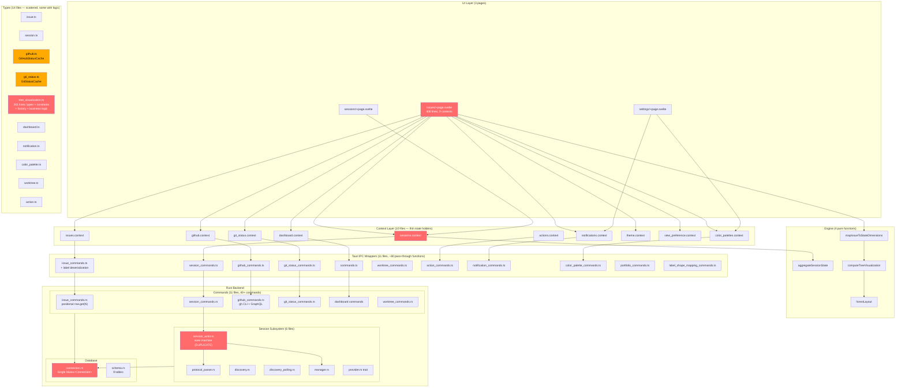
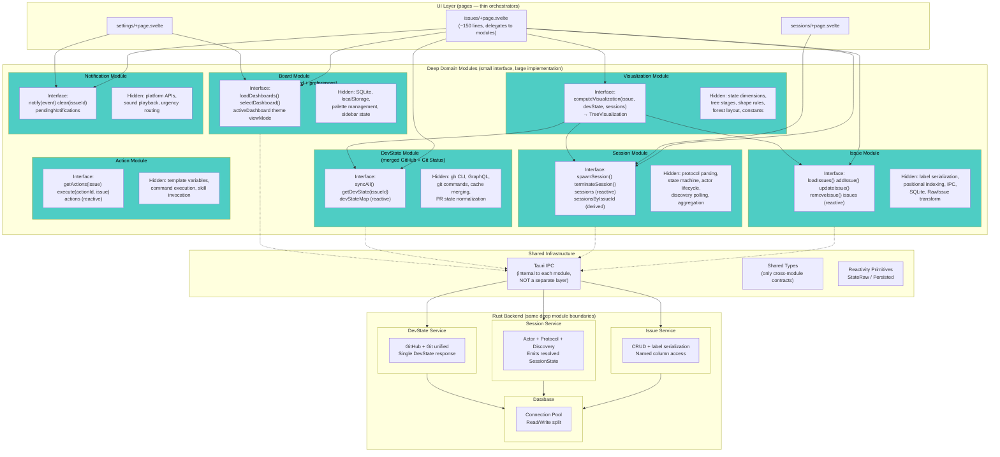
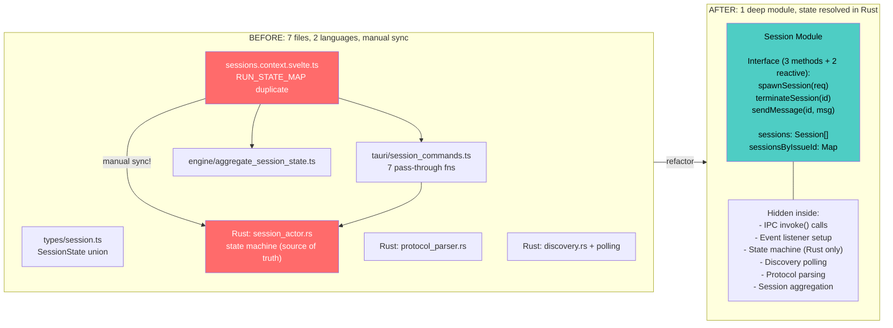
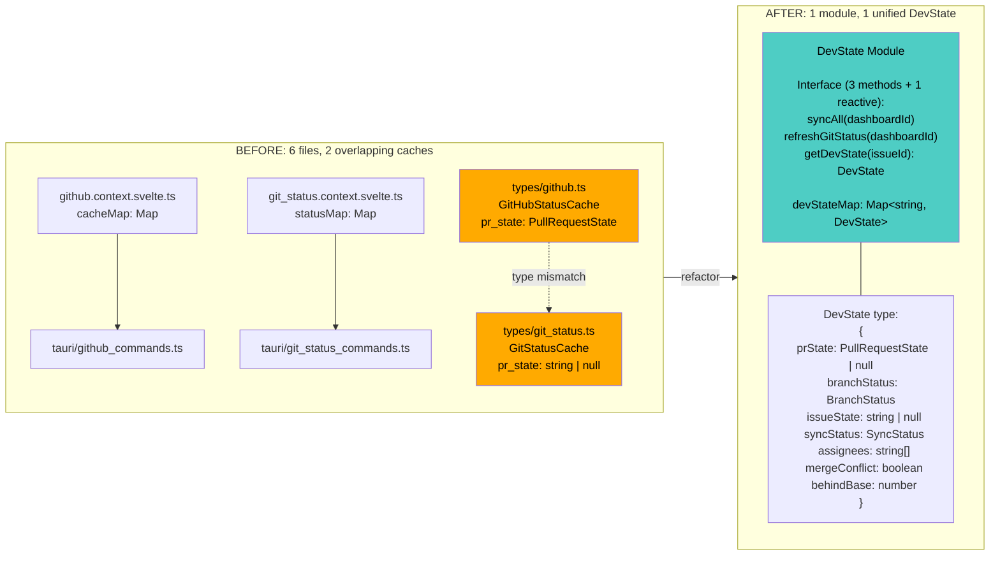
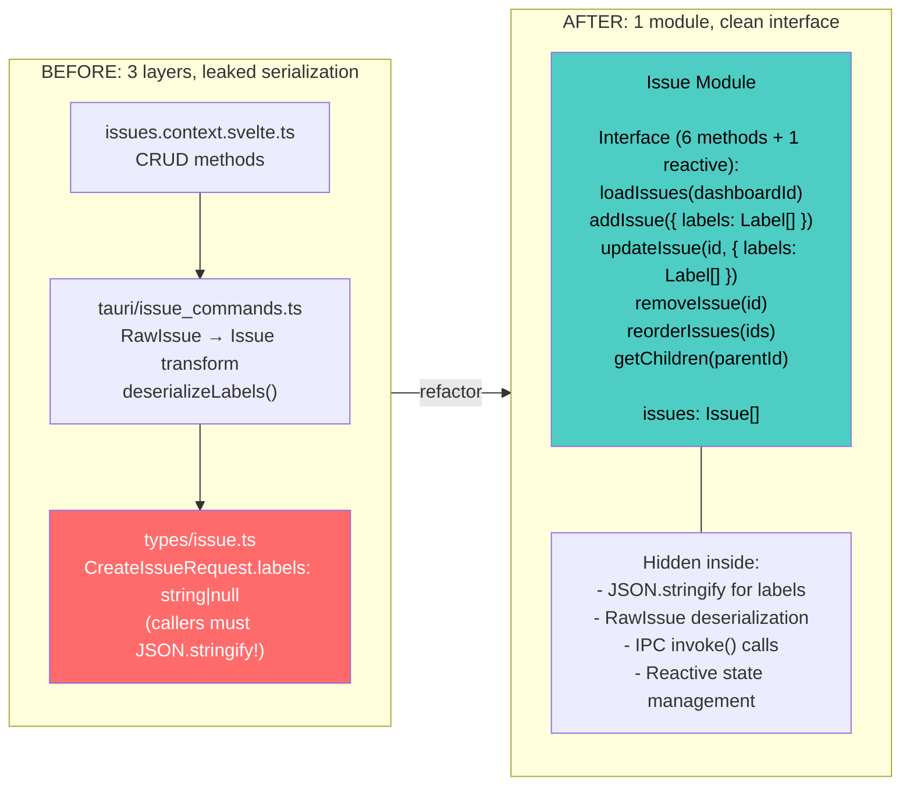
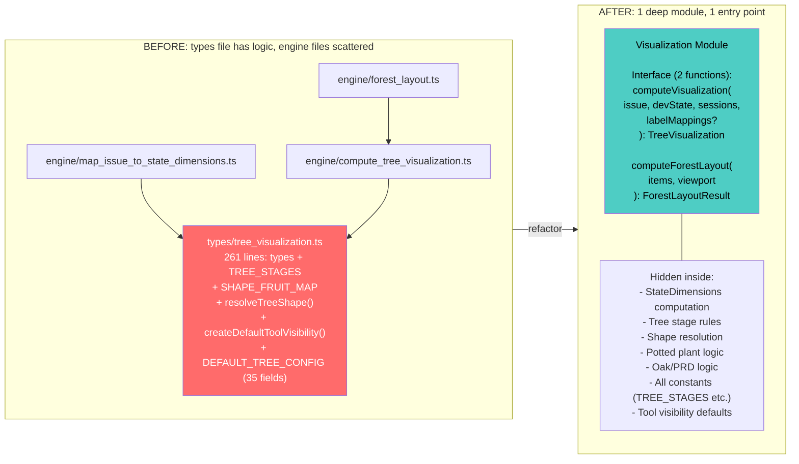
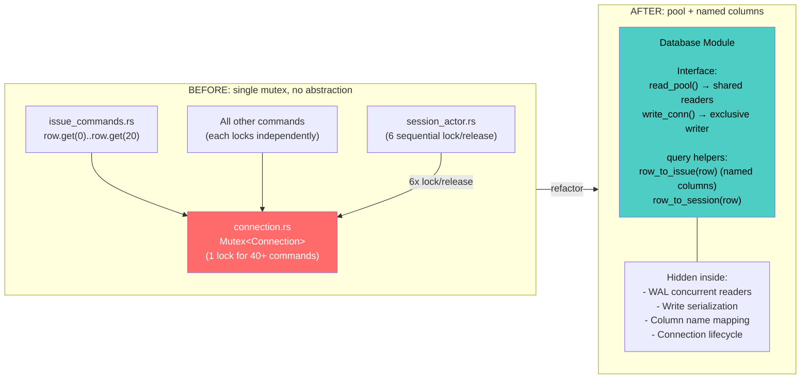
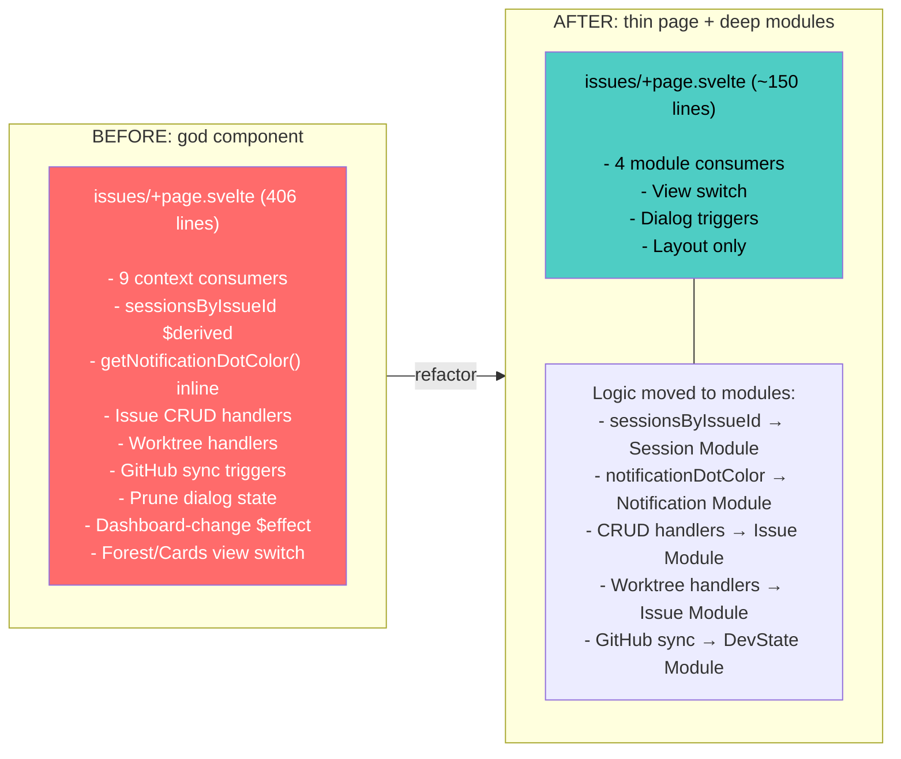

# Architecture Review: Deep Module Analysis

## Current Architecture — The Shallow Layer Problem



**Red = high-friction areas. Orange = type duplication.**

### What's wrong with this picture

| Problem                                 | Where                                                                     | Impact                                           |
| --------------------------------------- | ------------------------------------------------------------------------- | ------------------------------------------------ |
| **5 layers to cross** for any operation | UI → Context → Tauri → Rust Cmd → DB                                      | Understanding one feature means reading 5+ files |
| **Pass-through epidemic**               | 80 tauri wrapper functions that just call `invoke()`                      | Interface as complex as implementation (shallow) |
| **Dual state machines**                 | `session_actor.rs` + `sessions.context.svelte.ts`                         | Same logic in 2 languages, manual sync           |
| **Type drift**                          | `GitStatusCache` vs `GitHubStatusCache`, `ready-to-merge` missing in Rust | Runtime bugs from compile-time mismatches        |
| **God component**                       | `issues/+page.svelte` orchestrates everything                             | Untestable, hard to navigate                     |
| **Single DB lock**                      | One Mutex for 40+ commands                                                | All reads block all writes                       |
| **Mixed concerns in types**             | `tree_visualization.ts` has logic + constants + types                     | Can't import types without pulling everything    |

---

## Proposed Architecture — Deep Domain Modules



### What changes

| Before                                      | After                                                                       | Why                                              |
| ------------------------------------------- | --------------------------------------------------------------------------- | ------------------------------------------------ |
| Context + Tauri wrapper = 2 separate layers | **Merged into one module** — IPC is an implementation detail                | Eliminates pass-through layer entirely           |
| 14 type files shared globally               | **Types live inside their module** — only cross-module contracts are shared | Each module owns its types                       |
| github.context + git_status.context         | **One DevState module** — unified `DevState` object per issue               | Callers don't care where data came from          |
| State machine in Rust AND TypeScript        | **Rust emits resolved `SessionState`** — TS just displays it                | Single source of truth                           |
| `tree_visualization.ts` mixed concerns      | **Visualization module** owns types + constants + logic together            | Deep module: small interface, big implementation |
| `issues/+page.svelte` god component         | **Page just wires modules together** (~150 lines)                           | Logic lives in modules, not pages                |
| Single `Mutex<Connection>`                  | **Read/write connection split**                                             | Concurrent readers, WAL fully utilized           |

---

## Candidate Deep-Dives

### Candidate 1: Session Module



**Dependency category:** Remote-owned (Tauri IPC boundary)
**Key change:** Rust actor emits resolved `SessionState` in events. TypeScript `RUN_STATE_MAP` deleted entirely.
**Risk:** Low. The Rust side already has the correct mapping. We just stop duplicating it.

---

### Candidate 2: DevState Module (GitHub + Git Status merger)



**Dependency category:** True external (GitHub API) + In-process (git status)
**Key change:** One `DevState` type replaces two overlapping caches. `pr_state` is always typed (never raw string).
**Risk:** Medium. Need to verify all consumers of the separate caches. The visualization pipeline already merges them — this just moves the merge point earlier.

---

### Candidate 3: Issue Module (collapse 3 shallow layers)



**Dependency category:** Local-substitutable (SQLite via IPC)
**Key change:** Callers pass `Label[]` — serialization is hidden. No more `RawIssue` leak.
**Risk:** Low. Purely additive — wrap existing layers, then inline.

---

### Candidate 4: Visualization Module



**Dependency category:** In-process (pure computation)
**Key change:** `tree_visualization.ts` splits — types that cross module boundaries stay shared, everything else goes inside the module.
**Risk:** Low. Engine already has good tests. This is mostly file reorganization + interface simplification.

---

### Candidate 5: Database Layer (Rust)



**Dependency category:** Local-substitutable (SQLite)
**Key change:** Multiple reader connections + one writer. Named column access instead of positional.
**Risk:** Medium. SQLite WAL mode supports this, but need to verify rusqlite's multi-connection behavior. Session actor benefits most (6 sequential locks become parallel reads).

---

### Candidate 6: Page Decomposition



**Risk:** Low. This naturally follows from deepening the other modules — the page gets thinner as logic moves into modules.

---

## Requirements Conflict Check

| Candidate            | Requirement                                            | Conflict?                                                                                                             |
| -------------------- | ------------------------------------------------------ | --------------------------------------------------------------------------------------------------------------------- |
| Session Module       | R3: Multi-provider support (future)                    | **No conflict.** The `SessionProvider` trait stays. We're deepening the frontend module, not changing the Rust trait. |
| DevState Module      | R7: `gh` CLI + `git` CLI + `git2` crate                | **No conflict.** Multiple transports are an implementation detail hidden inside the module.                           |
| DevState Module      | R12: Forest view needs both git status and GitHub data | **Actually helps.** Forest view currently merges two caches — with unified DevState, it gets pre-merged data.         |
| Issue Module         | R2: Six creation paths                                 | **No conflict.** The module just needs to expose `addIssue()` with enough params. Creation paths are UI concerns.     |
| DB Layer             | R7: Performance during git/GitHub ops                  | **Actually helps.** Concurrent readers prevent sync operations from blocking UI reads.                                |
| Visualization Module | R12: 9 state dimensions, 11 stages                     | **No conflict.** The module still computes everything — just behind a smaller interface.                              |

### One potential friction point

**R3 Session modes (Spawn/Monitor/Adopt):** The Session Module must support all three modes behind the same interface. Currently, `spawnSession()` and `adoptSession()` are separate calls. The deep module should still expose both, but `sessions` (the reactive array) should be unified regardless of origin. This is already the case, so no conflict.

### Future-proofing check (Roadmap phases)

| Phase                           | Impact                                                                                                               |
| ------------------------------- | -------------------------------------------------------------------------------------------------------------------- |
| Phase 2: Evaluation Dashboard   | Needs session cost/token data → Session Module should expose `getSessionMetrics()`. Plan for this in the interface.  |
| Phase 3: Session Dashboard (R4) | Rich chat view needs session events → Session Module should expose `getSessionEvents(id)` for transcript rendering.  |
| Phase 4: Multi-Provider         | `SessionProvider` trait untouched. New providers plug into the Rust backend. Frontend Session Module doesn't change. |
| Phase 5: RAG Integration        | Needs session transcripts → same `getSessionEvents()` interface.                                                     |

---

## Reference Pattern: ts-rs (from vibe-kanban)

vibe-kanban uses the `ts-rs` crate to auto-generate TypeScript types from Rust structs. This would:

- **Eliminate F3** (ready-to-merge missing from Rust) — types are generated from Rust, so they can't drift
- **Eliminate F4** (dual state machine) — if Rust emits typed `SessionState`, TypeScript gets the same enum automatically
- **Eliminate F2** (GitStatusCache duplication) — one Rust struct → one TypeScript type

**Trade-off:** Adds a build step. Types are generated at build time, not authored manually. This is a one-time setup cost that pays dividends as the codebase grows.

**Recommendation:** Adopt `ts-rs` as part of the Session Module and DevState Module refactors. It naturally enforces the "single source of truth in Rust" principle.

---

## Suggested Priority Order

```
1. Session Module     — highest risk (dual state machine), clear win
2. DevState Module    — type drift is a bug waiting to happen
3. Issue Module       — quick win, low risk, removes pass-through layer
4. Visualization      — mostly file reorg, good cleanup
5. DB Layer           — medium effort, performance benefit grows with usage
6. Page Decomposition — falls out naturally from 1-4
```

Cross-cutting: adopt `ts-rs` during candidates 1 and 2 to prevent future type drift.
